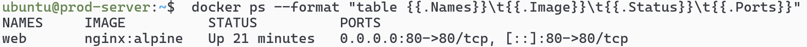
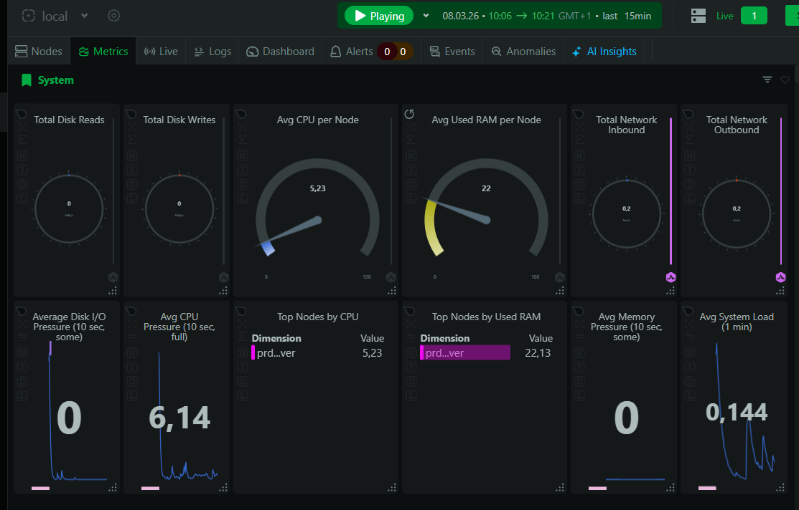

# Linux Production Server Lab

## Overview

This project simulates a **small production Linux server environment** built on **Ubuntu Server 22.04**.
The goal of the lab is to demonstrate practical **Linux System Administration skills** such as container deployment, monitoring, server security, and automated backups.

---

## Architecture
The following diagram shows the structure of the lab environment and how the components interact.


System flow:

User → Internet → Ubuntu Server

Services running on the server:

* **Docker**

  * Nginx container (web service)
* **Monitoring**

  * Netdata dashboard
* **Backup system**

  * Bash backup script
  * Cron scheduled automation

---

## Technologies Used

* Ubuntu Server 22.04
* Docker
* Docker Compose
* Nginx
* Netdata Monitoring
* Bash scripting
* Cron scheduling
* UFW Firewall
* Fail2ban
* SSH key authentication

---

## Features

### Containerized Web Service

A web server is deployed using Docker. The application runs inside an **Nginx container**
and exposes port **80** to the host system.



```
docker-compose up -d
```

Nginx runs inside a container and serves the application.

---

### System Monitoring

The server is monitored using **Netdata**, which provides real-time visibility
into system performance and resource usage.
Netdata helps detect performance issues and monitor the health of the server in real time.



Netdata collects metrics for:

- CPU usage
- RAM usage
- Disk I/O
- Network traffic
- Docker containers

Dashboard access:

```
http://SERVER-IP:19999
```

---

### Backup Automation

Server configuration is automatically backed up using a Bash script.

Daily backups are automated using cron to ensure regular snapshots
of important server configuration files.


Backup script:

```
/opt/backups/backup.sh
```

Daily backup scheduled with cron:

```
0 2 * * * /opt/backups/backup.sh
```

---

## Skills Demonstrated

* Linux server administration
* Container deployment with Docker
* System monitoring setup
* Backup automation with Bash and Cron
* Server security configuration
* Troubleshooting production issues

---

## Conclusion

This project demonstrates how to build and manage a simplified **Linux production server environment**.
It highlights core responsibilities of a **Junior Linux System Administrator**, including
container deployment, monitoring, automation, and basic server security.
