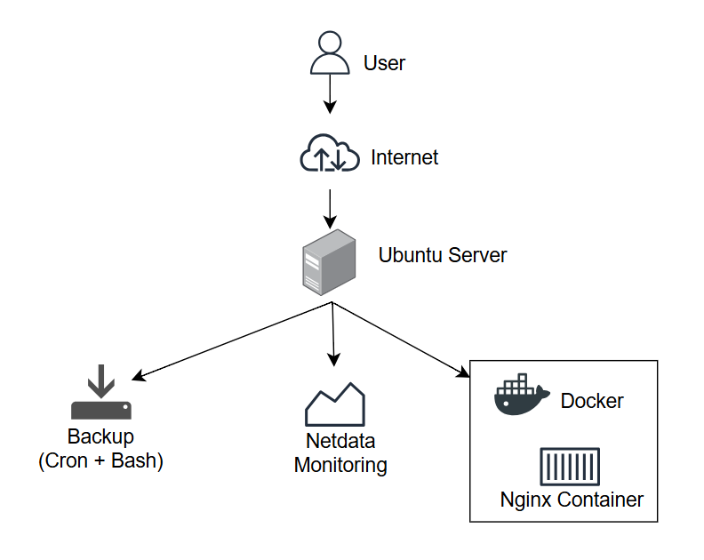

# Linux Production Server Lab

## Overview

This project simulates a **small production Linux server environment** built on **Ubuntu Server 22.04**.
The goal of the lab is to demonstrate practical **Linux System Administration skills** such as container deployment, monitoring, server security, and automated backups.

---

## Architecture



System flow:

User → Internet → Ubuntu Server

Services running on the server:

* **Docker**

  * Nginx container (web service)
* **Monitoring**

  * Netdata dashboard
* **Backup system**

  * Bash backup script
  * Cron scheduled automation

---

## Technologies Used

* Ubuntu Server 22.04
* Docker
* Docker Compose
* Nginx
* Netdata Monitoring
* Bash scripting
* Cron scheduling
* UFW Firewall
* Fail2ban
* SSH key authentication

---

## Features

### Containerized Web Service

A web server is deployed using Docker.

```
docker-compose up -d
```

Nginx runs inside a container and serves the application.

---

### System Monitoring

Netdata provides real-time monitoring for:

* CPU usage
* RAM usage
* Disk usage
* Network traffic
* Docker containers

Dashboard access:

```
http://SERVER-IP:19999
```

---

### Backup Automation

Server configuration is automatically backed up using a Bash script.

Backup script:

```
/opt/backups/backup.sh
```

Daily backup scheduled with cron:

```
0 2 * * * /opt/backups/backup.sh
```

---

## Skills Demonstrated

* Linux server administration
* Container deployment with Docker
* System monitoring setup
* Backup automation with Bash and Cron
* Server security configuration
* Troubleshooting production issues

---

## Conclusion

This project demonstrates how to build and manage a simplified **Linux production server environment**, showcasing essential skills required for a **Junior Linux System Administrator** role.
